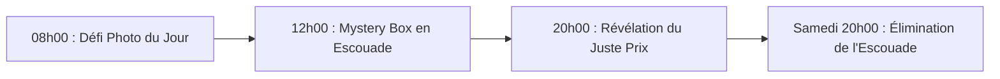

# VALUO — Le jeu social des curieux et passionnés de design 🏺✨

> **VALUO** est une application web progressive (PWA) gamifiée conçue autour de rituels quotidiens : défis photos à thème, duels d'estimation de valeur d'objets mystères (*Juste Prix*) et survie en escouade de 4 joueurs avec élimination hebdomadaire.

---

## 🎯 Le Concept & Les 3 Rituels Quotidiens



1. **📸 Défi Photo Quotidien (08h00 → 23h59)**  
   Chaque matin à 08h00, un thème visuel et une consigne sont lancés (ex : *« Un objet rouge iconique »*, *« Une chaise d'architecte »*). Les joueurs photographient leur trouvaille et la publient sur le Feed pour remporter **+20 points VALUO**.
2. **📦 Mystery Box & Juste Prix (12h00 → 20h00)**  
   Chaque joueur appartenant à une escouade doit soumettre son estimation de la valeur marchande de l'objet mystère. À 20h00, le prix réel est révélé et des points bonus sont attribués aux estimations les plus proches.
3. **⚔️ Escouade de 4 & Survie Hebdomadaire (Samedi 20h00)**  
   Les joueurs s'affrontent au sein d'une escouade de 4 membres (créée entre amis avec code d'invitation ou via matchmaking automatique). Chaque samedi à 20h00, le joueur ayant cumulé le score le plus faible est éliminé.
4. **💬 Feed Social & Communauté**  
   Fil d'actualité en direct, likes, commentaires imbriqués (réponses en cascade avec notifications instantanées), gestion d'amis et profils personnalisés.

---

## 🛠️ Stack Technique

### Frontend
- **Framework :** [React 19](https://react.dev/) + [TypeScript](https://www.typescriptlang.org/)
- **Build Tool :** [Vite 8](https://vitejs.dev/)
- **Design & Animations :** [TailwindCSS v4](https://tailwindcss.com/) + [Framer Motion](https://www.framer.com/motion/)
- **Iconographie :** [Lucide React](https://lucide.dev/)
- **Typographie :** Organixy (Custom Display) + Playfair Display + DM Sans

### Backend & Cloud
- **Base de données :** [Supabase](https://supabase.com/) (PostgreSQL 15+)
- **Temps Réel :** Supabase Realtime (WebSockets pour publications, likes, commentaires et notifications)
- **Sécurité :** Row Level Security (RLS) avec politiques fines par utilisateur
- **Stockage :** Supabase Storage (Buckets pour photos des défis et objets mystères)
- **Serverless :** Supabase Edge Functions (Emails transactionnels et déclencheurs)

### PWA (Progressive Web App)
- Service Worker dédié (`sw.js`) pour mise en cache hors-ligne
- Manifeste (`manifest.webmanifest`) avec support d'installation plein écran sur Android & iOS
- Gestion proactive des notifications push

---

## 📂 Architecture du Projet

```text
VALUO/
├── public/                  # Assets publics, icônes PWA, polices, manifeste & SW
│   ├── fonts/               # Police Organixy
│   ├── manifest.webmanifest # Configuration PWA
│   └── sw.js                # Service Worker
├── src/
│   ├── components/          # Composants globaux (Logo, Navigation desktop/mobile, Header)
│   ├── features/            # Modules fonctionnels découplés :
│   │   ├── admin/           # Dashboard administrateur (gestion défis, mystery boxes, feed)
│   │   ├── auth/            # Authentification, écran de connexion/inscription, modal mdp
│   │   ├── feed/            # Fil d'actualité, publications, commentaires imbriqués, composer
│   │   ├── game/            # Vue du jeu Mystery Box, estimation & compte à rebours
│   │   ├── groups/          # Gestion des escouades, matchmaking, invitations et classements
│   │   ├── notifications/   # Centre de notifications temps réel & filtres multi-catégories
│   │   ├── onboarding/      # Tunnel d'onboarding en 5 étapes (Profil, Règles, Escouade, Sécurité, PWA)
│   │   └── profile/         # Profil joueur, statistiques, historique, réglages
│   ├── lib/                 # Utilitaires d'API, client Supabase, gestion des dates, sécurité
│   ├── App.tsx              # Composant racine, orchestration d'état & routeur
│   ├── data.ts              # Types TypeScript partagés & presets
│   ├── index.css            # Feuille de style globale et tokens Tailwind
│   └── main.tsx             # Point d'entrée React
├── supabase/
│   ├── functions/           # Edge Functions (ex: send-welcome-email)
│   └── migrations/          # Schémas SQL, déclencheurs temps réel et politiques RLS
├── package.json             # Dépendances & scripts npm
└── vite.config.ts           # Configuration Vite
```

---

## 🚀 Démarrage Rapide

### 1. Prérequis
- [Node.js](https://nodejs.org/) (version 18+ recommandée)
- Un projet [Supabase](https://supabase.com/) configuré

### 2. Installation des dépendances
```bash
npm install
```

### 3. Configuration des variables d'environnement
Créez un fichier `.env` à la racine du projet (sur le modèle de `.env.example`) :
```env
VITE_SUPABASE_URL=https://votre-projet.supabase.co
VITE_SUPABASE_ANON_KEY=votre_cle_publique_anon
```

### 4. Lancement en développement
```bash
npm run dev
```
L'application est accessible sur `http://localhost:5173`.

### 5. Build pour production
```bash
npm run build
```

---

## 🗄️ Base de Données & Migrations

Les scripts de migration SQL sont situés dans `supabase/migrations/` et couvrent :
- `daily_challenges` : Définition des thèmes et plannings quotidiens.
- `mystery_boxes` & `box_estimates` : Objets mystères, soumissions et calcul automatique des classements.
- `squads` & `squad_members` : Escouades de 4 joueurs, chefs d'escouade et scores cumulés.
- `feed_posts`, `feed_likes`, `feed_comments` : Système social avec hiérarchie de réponses.
- `notifications` : Système temps réel d'alertes sociales et de jeu.

---

## 📄 Licence
Ce projet est développé pour **VALUO**. Tous droits réservés.

